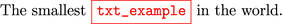

`jinjaNG` tools for (La)Tex like files
======================================

How to use the tools?
---------------------

Here is the miminal way to use the tools from the package `jnglatex`. Note the use of `%: if False ... %: endif` suchas to import the package `jnglatex` only when working on the template.

~~~latex
\documentclass[12pt]{article}
%: if False
\usepackage{jnglatex}
%: endif

\begin{document}

The smallest \JNGVALOF{txt_example} in the world.

\end{document}
~~~

This template will produce the output shown in the following picture.

---

---

> **WARNING.**
>
> The `jinja` variables can't be used as one `LaTeX` parameter.

What is done behind the scenes?
-------------------------------

The `color` package is used to format the names of `jinja` variables in red inside a red box.
